# CKB-Studio

CKB Studio is an IDE to develop CKB scripts for [Nervos](http://nervos.io/) blockchain. It includes CKB compiler, block explorer, node and miner for local dev chain, Aggron testnet and the CKB mainnet. The TX Constructor provides a convenient tool to generate from regular transfer to UDT and anyone-can-pay transactions.

## Installation

### Download
Installation packages are provided in [releases](https://github.com/ObsidianLabs/CKB-Studio/releases). Please select the appropriate format according to your operating system (.dmg or .zip for Mac OS, .AppImage for Linux).

### Install

- **MacOS**: Double-click to open `CKBStudio-x.x.x.dmg` and drag *CKB Studio* into the *Applications* folder.
- **Linux**: Right-click `CKBStudio-x.x.x.AppImage`, select *Properties* => *Permissions* => *Execute*, and check the option *Allow executing file as progrom*. Close the property window and double-click the application to open it (different Linux systems may have slightly different installation procedures).

## Feature Walkthrough

### Prerequisites

When CKB Studio is properly installed and started for the first time, it will display a welcome page to help you install the dependencies for CKB development - *Docker*, *CKB Node* and *CKB Compiler*.

  

- CKB Studio uses [Docker](https://www.docker.com/) to run CKB node and the compiler. If you don't have Docker installed before, click the Install Docker button to open the Docker official website and follow the instructions to download and install.
- CKB Node is a [docker image](https://hub.docker.com/r/nervos/ckb-riscv-gnu-toolchain) that contains all the necessary softwares and dependencies to start a CKB node. You can install different node versions in the dropdown menu.
- CKB Compiler is a [docker image](https://hub.docker.com/r/nervos/ckb) that contains all the necessary softwares and dependencies to compiel a CKB project. You can install different compiler versions in the dropdown menu.

### Projects

#### Create a Project
The main interface will show a list of CKB projects. If you open CKB Studio for the first time, this list will be empty.

Click the New button to open the Create a New Project popup window. CKB Studio provides some templates to help you start your development:

- *[Javascript] moleculec-es*
- *[Javascript] molecule-javascript*
- *[Javascript] minimal*
- *[Javascript] HTLC*
- *[C] carrot*
- *[C] Simple UDT*
- *Duktape*

After selecting the appropriate template, type the project location and the project name, and click the Create Project button.

  

After a project is created, CKB Studio will automatically navigate to the project editor.

#### Build the Project
Click the *Build* button (with the hammer icon) in the project toolbar (above the file tree) to compile the current CKB project.

  

There is an extra step before building a Javascript project, you will need to type command `npm install` or `yarn` manually in the terminal to install the project dependecies.

  

The compiled files will be at different locations based on different kinds of project:
- Javascript locates at `./build/duktape.js`
- C locates at `./[your_project_name].o`

#### Debug a Project
Click the *Debug* button (with the bug icon) in the project toolbar (above the file tree) to debug the current CKB project.

  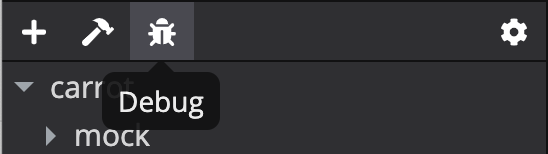

The debugger helps you to find the bugs in the project easily.

  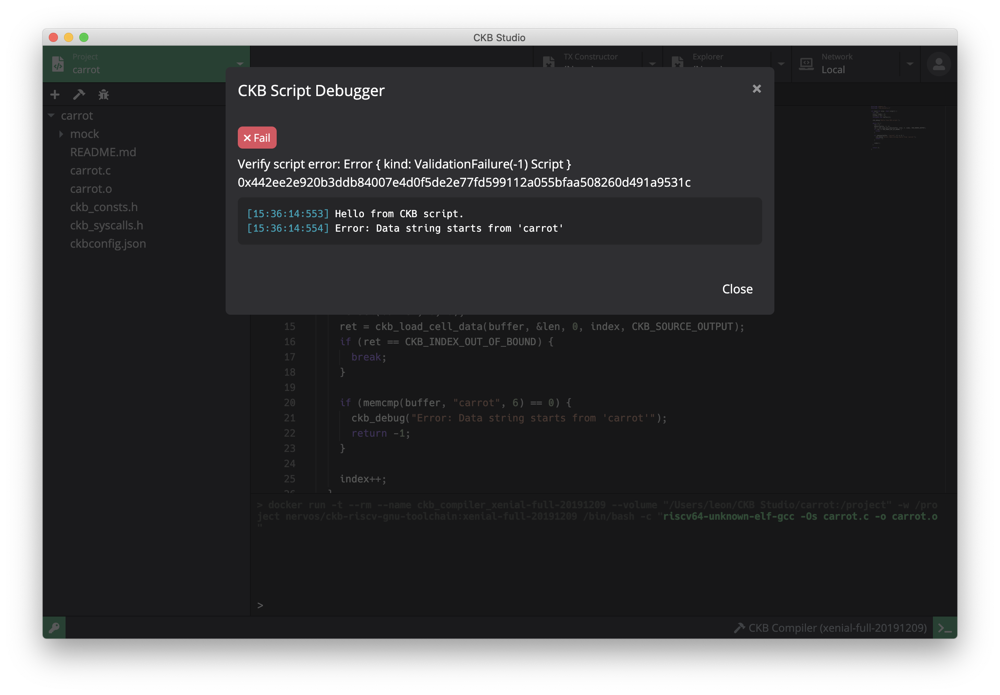

### Keypair Manager
Click the green button (with the key icon) in the bottom left corner to open the keypair manager. In the keypair manager, you can create, import, and delete CKB keys. Create two keypairs and save them into keypair manager, we will use these keypairs for the next part.

  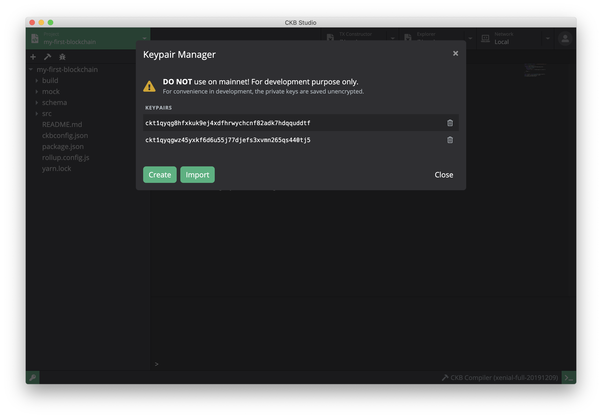

Please note the keys in the Keypair Manager are for development purpose, the private keys are saved unencrypted. **DO NOT** use them on mainnet.

### Run CKB Nodes

#### Create a Node Instance
Click the *Network* tab in the header to open the CKB network manager, where you can start the CKB node. If you open CKB Studio for the first time, this instance list will be empty.

  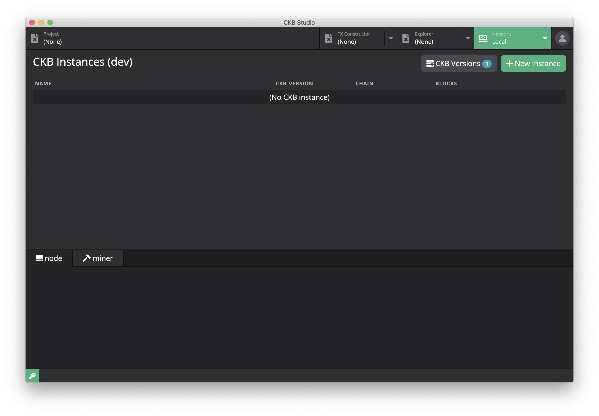

Click the *New Instance* button to open the New Instance window, type the instance name and select the appropriate CKB version. Select the block assembler (miner) public key we've created in the [Keypair Manager](#keypair-manager) section. Now you can click the *Create* button to create the node instance.

  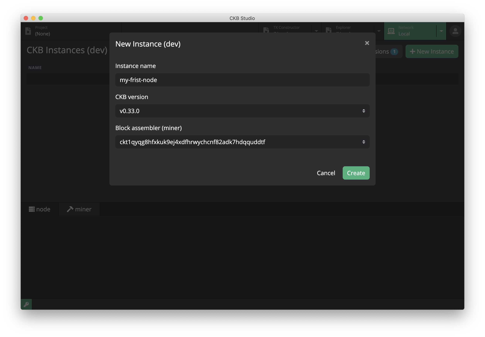

#### Start the Node
Click the *Start* button of the newly created node instance to start a CKB node. Once the node is started, you can explore the node log and miner log in the log monitor.

  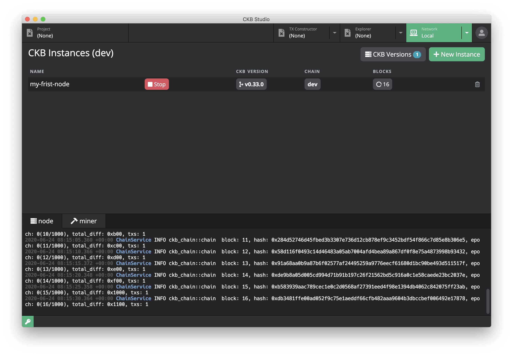

#### Switch networks
In the `Network` dropdown menu, you can switch the current network to mainnet and testnet. Please note that switching networks will stop your running node instance.

  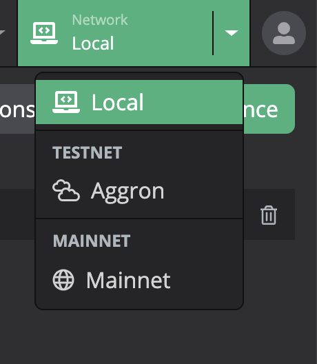

### Explorer
Click the *Explorer* tab in the header to open the CKB Explorer, where you can explore account information.

You can paste a public key to the address bar and hit enter key, if the account exists, the Explorer will reload the page and show the account information including account balance, live cells, account addresses, public keys, lock hash and transactions. You can click the refresh button to update the account information.

  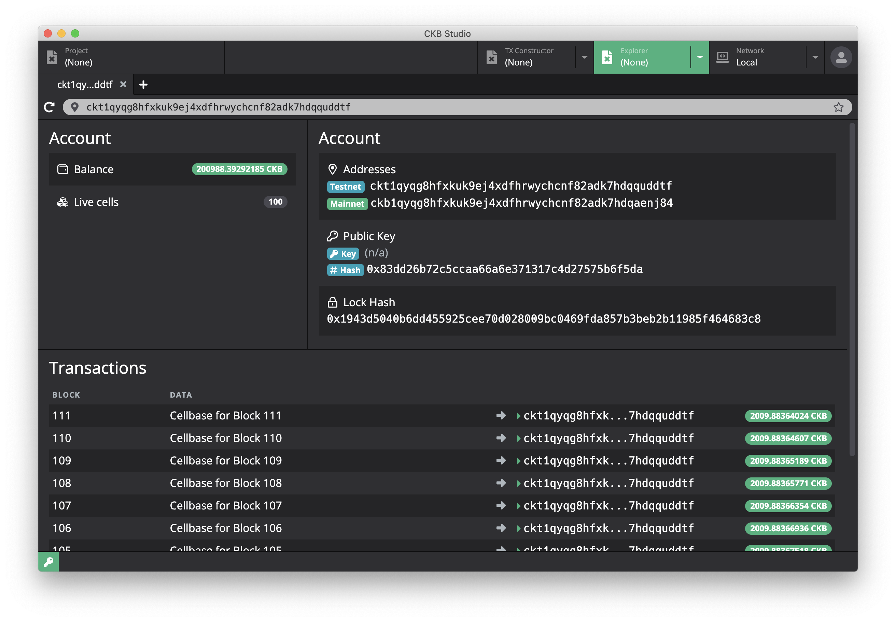

### Transaction Constructor
Click the *TX Constructor* tab in the header to open the transaction constructor, where you can construct a CKB transaction.

  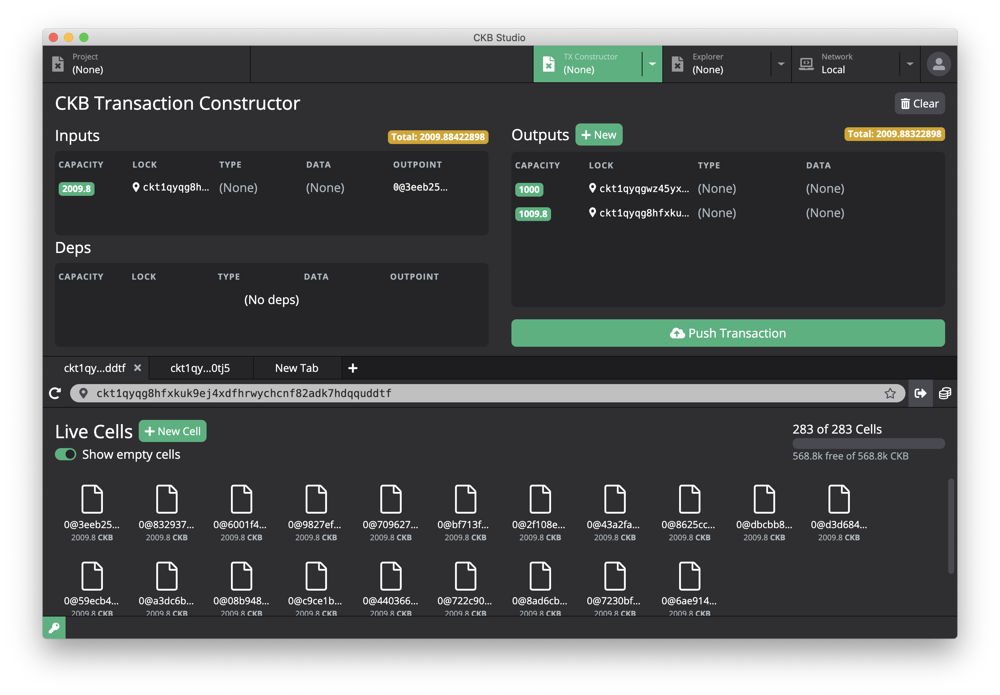

#### Cell Explorer
Cell explorer is the place where you can explore you cells.

  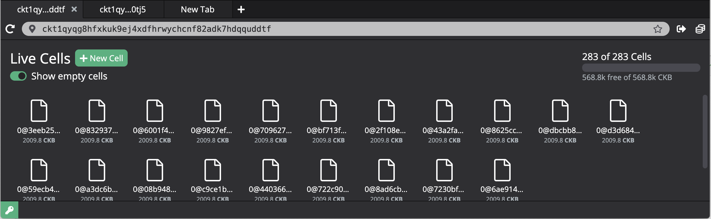

There are some features to help with the transaction constructor:
- Cells information including total number and usage
- *Show empty cells* option helps you to find the empty cells
- Drag the cells to the *Input* field to construct inputs
- *New Cell* helps to construct a new cell with custom data
- *Transfer* (next to the address bar) helps to construct a transfer transaction
- *Mint UDT* helps to mint UDT 

#### Construct a Transaction manually
You can generate a CKB transaction manually using Transaction Constructor.

You will need some empty cells before making transactions. Turn on the *Show empty cells* option and you will find the empty cells in the Cell Explorer, drag some of them to the *Inputs* field, you will find the total capacity (a orange block) in the upper right corner of *Inputs* field.

Once you have inputs, you can create outputs in the *Outputs* field. Click the *New* button next to the *Outputs* to open the output constructor window. Type the capacity, address, type scripts and data to create a output.

  

If you want to clear all the inputs and outpus field and reset them to empty, you can click the *Clear* button in the upper right.

Once the inputs and outputs are set properly, click the *Push Transaction* button to open transaction detail window, it will show the raw data of the transaction. Check the checkout next to your public key and click the *Sign transaction* button, Transaction Constructor will help you to sign the transaction with your key and the *Sign transaction* button will change to *Push transaction* button. Click the *Push transaction* button and the transaction will be submitted.

  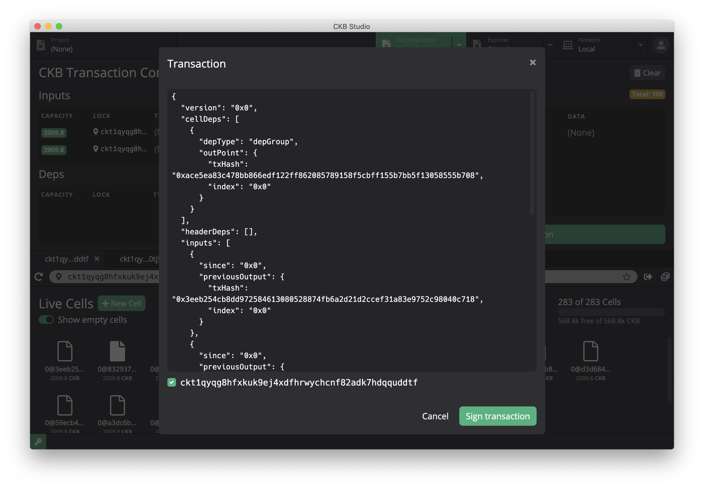

#### Generate a transcation
You can generate a transaction rather than constructing manually. Click the *Transfer* button next to adress bar in Cell Explorer to open the *Transfer* window. Select the token, type the amount and paste the receiver public key, then click the *Preview* button, transaction constructor will help you to fill all the inputs and outpus.

  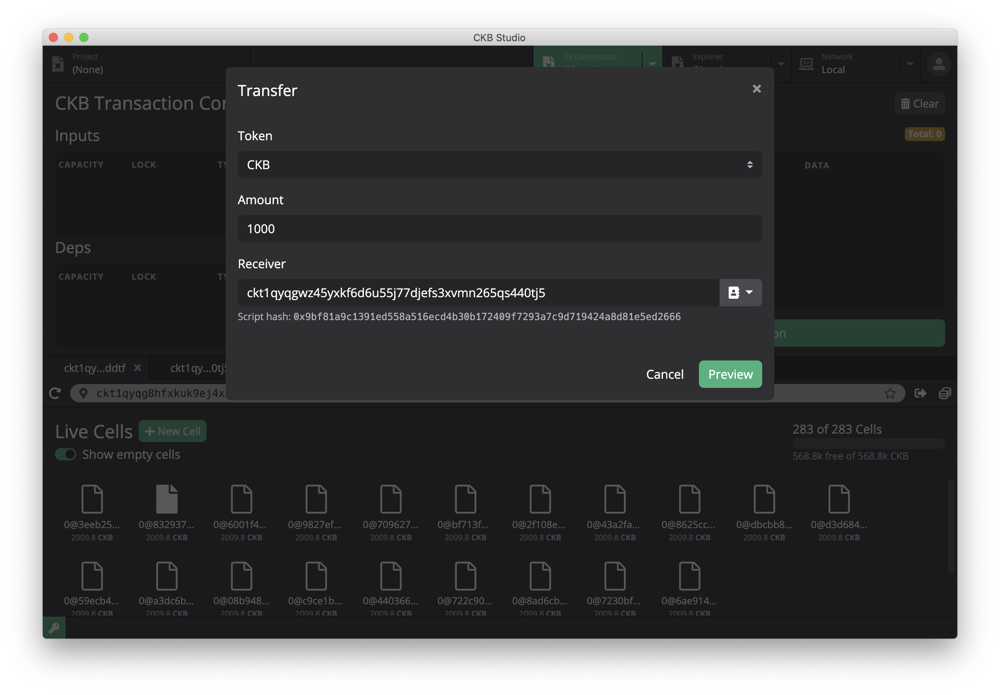

#### User Defined Token
You can create a user defined token using *Mint UDT*. Click the *Mint UDT* button next to the *Transfer* button to open *Mint UDT* window. Edit the UDT symbol and name, type the amount and receiver, click *Preview* button, transaction constructor will help you to fill all the inputs and outpus.

  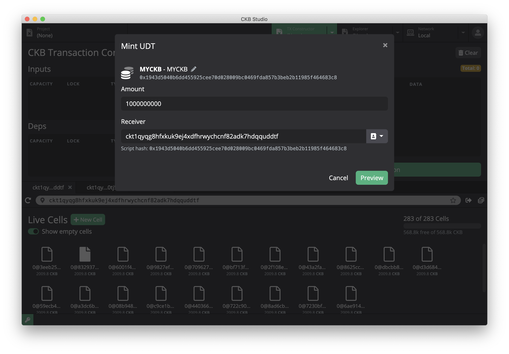

