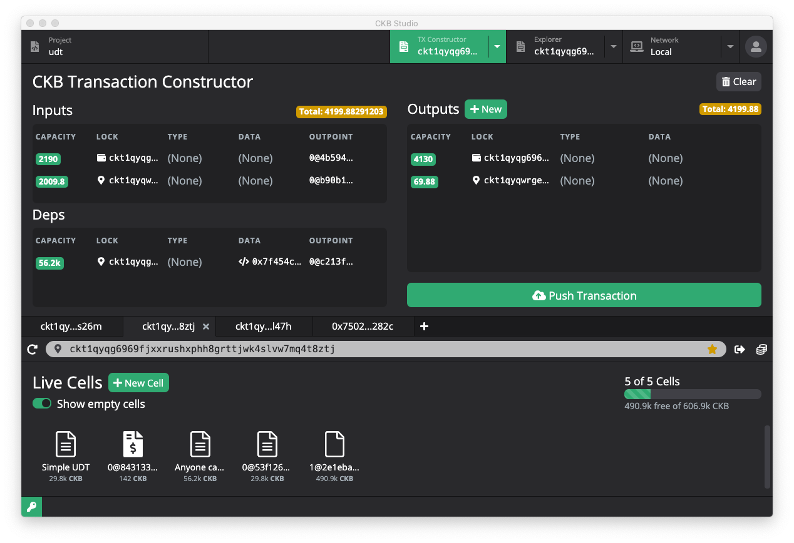
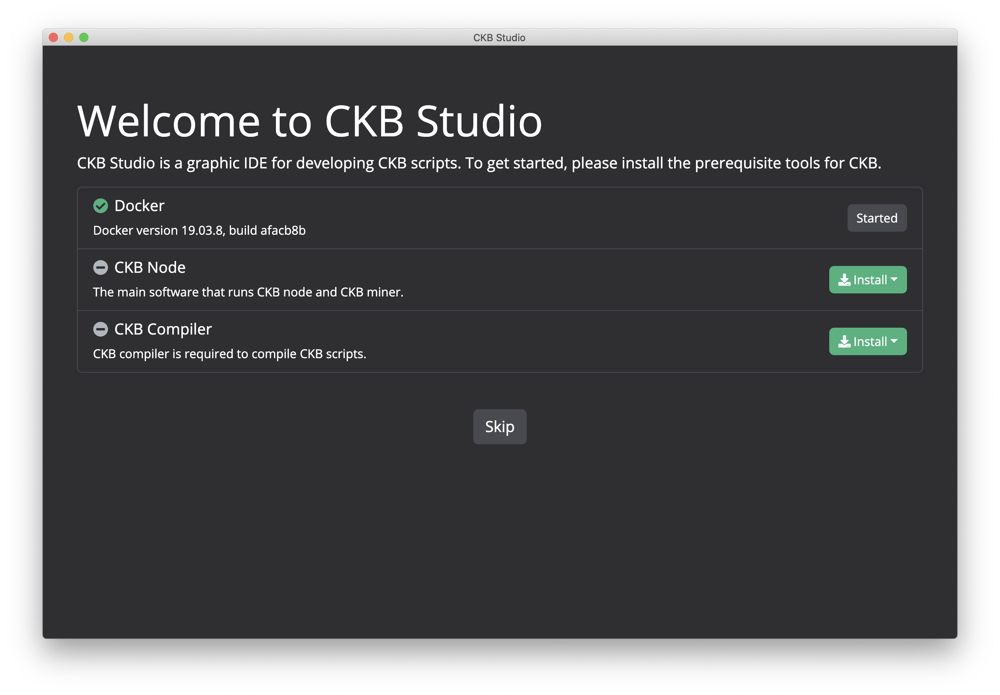
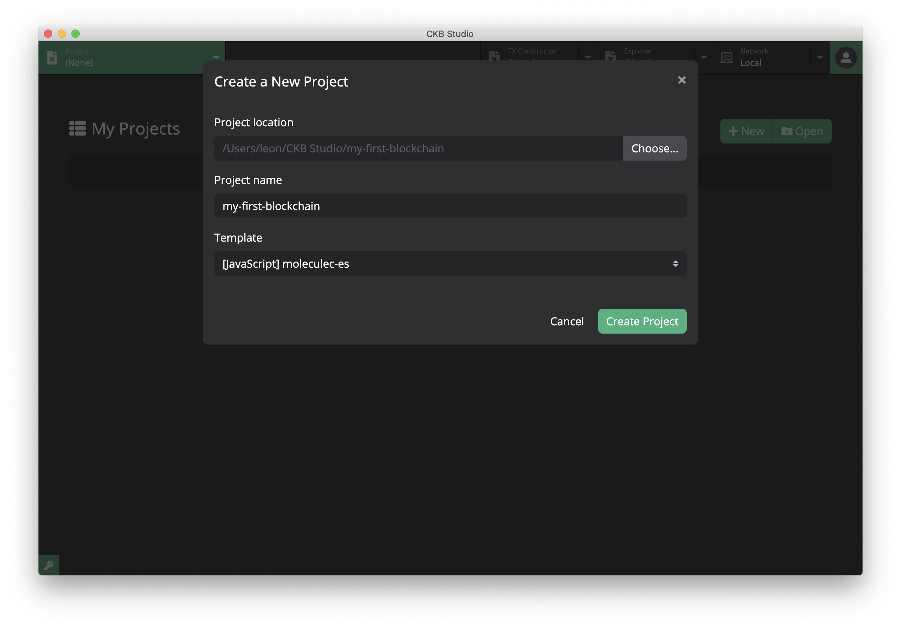
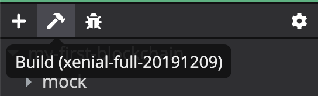

# CKB-Studio

CKB Studio is an IDE to develop CKB scripts for [Nervos](http://nervos.io/) blockchain. It includes CKB compiler, block explorer, node and miner for local dev chain, Aggron testnet and the CKB mainnet. The TX Constructor provides a convenient tool to generate from regular transfer to UDT and anyone-can-pay transactions.

## Installation

### Download
Installation packages are provided in [releases](https://github.com/ObsidianLabs/CKB-Studio/releases). Please select the appropriate format according to your operating system (.dmg or .zip for Mac OS, .AppImage for Linux).

### Install

- **MacOS**: Double-click to open `CKBStudio-x.x.x.dmg` and drag *CKB Studio* into the *Applications* folder.
- **Linux**: Right-click `CKBStudio-x.x.x.AppImage`, select *Properties* => *Permissions* => *Execute*, and check the option *Allow executing file as progrom*. Close the property window and double-click the application to open it (different Linux systems may have slightly different installation procedures).

## Feature Walkthrough

### Prerequisites

When CKB Studio is properly installed and started for the first time, it will display a welcome page to help you install the dependencies for CKB development - *Docker*, *CKB Node* and *CKB Compiler*.

  

- CKB Studio uses [Docker](https://www.docker.com/) to run CKB node and the compiler. If you don't have Docker installed before, click the Install Docker button to open the Docker official website and follow the instructions to download and install.
- CKB Node is a [docker image](https://hub.docker.com/r/nervos/ckb-riscv-gnu-toolchain) that contains all the necessary softwares and dependencies to start a CKB node. You can install different node versions in the dropdown menu.
- CKB Compiler is a [docker image](https://hub.docker.com/r/nervos/ckb) that contains all the necessary softwares and dependencies to compiel a CKB project. You can install different compiler versions in the dropdown menu.

### Projects

#### Create a Project
The main interface will show a list of CKB projects. If you open CKB Studio for the first time, this list will be empty.

Click the New button to open the Create a New Project popup window. CKB Studio provides some templates to help you start your development:

- *[Javascript] moleculec-es*
- *[Javascript] molecule-javascript*
- *[Javascript] minimal*
- *[Javascript] HTLC*
- *[C] carrot*
- *[C] Simple UDT*
- *Duktape*

After selecting the appropriate template, type the project location and the project name, and click the Create Project button.

  

After a project is created, CKB Studio will automatically navigate to the project editor.

#### Build the Project
Click the *Build* button (with the hammer icon) in the project toolbar (above the file tree) to compile the current CKB project.

  

There is an extra step before building a Javascript project, you will need to type command `npm install` or `yarn` in the terminal to install the project dependecies.

#### Debug a Project

### Keypair Manager

### Run CKB Nodes

#### Create a Node Instance

#### Start the Node

#### Switch networks

### Explorer

### Transaction Constructor

#### Cell Explorer

#### Construct a Transaction manually

#### Generate a transcation

#### User Defined T oken

#### Mint UDT (Cannot read property 'outPoint' of undefined)
