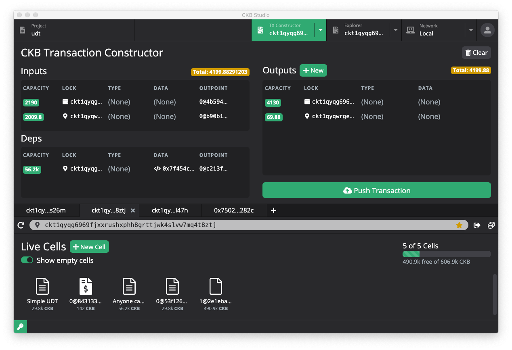

# CKB-Studio

CKB Studio is an IDE to develop CKB scripts for [Nervos](http://nervos.io/) blockchain. It includes CKB compiler, block explorer, node and miner for local dev chain, Aggron testnet and the CKB mainnet. The TX Constructor provides a convenient tool to generate from regular transfer to UDT and anyone-can-pay transactions.

You can go to [releases](https://github.com/ObsidianLabs/CKB-Studio/releases) to download installation packages.