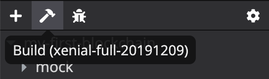

# CKB-Studio

CKB Studio is an IDE to develop CKB scripts on the [Nervos](http://nervos.io/) blockchain. It includes

- [CKB Script Editor](#ckb-script-editor) - code CKB scripts and use the integrated [compiler](#compiler) and [debugger](#debugger)
- [CKB Keypair Manager](#ckb-keypair-manager) - create and manage CKB keypairs
- [CKB Node Manager](#ckb-node-manager) - run CKB node and miner; switch between local, Aggron testnet and the CKB mainnet
- [CKB Explorer](#ckb-explorer) - view account information and transaction history
- [CKB Transaction Constructor](#ckb-transaction-constructor) - generate CKB transactions conveniently

## Installation

### Download

Installation packages are provided in [releases](https://github.com/ObsidianLabs/CKB-Studio/releases). Please select the appropriate format according to your operating system (`.dmg` or `.zip` for Mac OS, `.AppImage` for Linux).

### Install

- **MacOS**: Double-click to open `CKBStudio-x.x.x.dmg` and drag *CKB Studio* into the *Applications* folder.
- **Linux**: Right-click `CKBStudio-x.x.x.AppImage`, select *Properties* => *Permissions* => *Execute*, and check the option *Allow executing file as progrom*. Close the property window and double-click the application to open it (different Linux systems may have slightly different installation procedures).

## Feature Walkthrough

### Install Dependencies for CKB Development

When CKB Studio is started for the first time, it will display a welcome page to help you install the dependencies for CKB development - *Docker*, *CKB Node* and *CKB Compiler*.

  

- CKB Studio uses [Docker](https://www.docker.com/) to run CKB node and the compiler. If you don't have Docker installed before, click the Install Docker button to open the Docker official website and follow the instructions to download and install.
- [CKB Node](#ckb-node-manager) is a docker image ([`nervos/ckb`](https://hub.docker.com/r/nervos/ckb)) that contains all the necessary softwares and dependencies to start a CKB node. You can install different node versions in the dropdown menu.
- [CKB Compiler](#compiler) is a docker image ([`nervos/ckb-riscv-gnu-toolchain`](https://hub.docker.com/r/nervos/ckb-riscv-gnu-toolchain)) that contains all the necessary softwares and dependencies to compiel a CKB project. You can install different compiler versions in the dropdown menu.

### CKB Script Editor

#### Project List

The main interface will show a list of CKB projects. If you open CKB Studio for the first time, this list will be empty. You can click the *New* button to create a new CKB project. CKB Studio has provided a list of templates to help you get started:

- [JavaScript] moleculec-es
- [JavaScript] molecule-javascript
- [JavaScript] minimal
- [JavaScript] HTLC
- [C] carrot
- [C] Simple UDT
- Duktape

  

After a project is created, CKB Studio will automatically navigate to the project editor.

#### Compiler

Click the *Build* button (with the hammer icon) in the project toolbar (above the file tree) to compile the current CKB project. CKB Studio will choose the right compiler to use depending on the project language (JavaScript or C).

  

There is an extra step before building a JavaScript project. You will need to type the command `npm install` or `yarn` manually in the terminal to install the project dependecies.

  

The compiled files will be at different locations based on the project language:
- `build/*` for JavaScript project
- `{script_name}.o` for C project

#### Debugger

CKB Studio has integrated the [CKB debugger](https://github.com/xxuejie/ckb-standalone-debugger). Click the *Debug* button (with the bug icon) in the project toolbar to debug the current CKB project.

  

The debugger will run the mocked transaction defined in `mock/tx.json` (or the file defined in the project settings). It will help you run the CKB script and check the execution result very easily.

  

### CKB Keypair Manager

Click the green button (with the key icon) in the bottom left corner to open the keypair manager. In the keypair manager, you can create, import, and manage CKB keys. Make sure you created some keypairs before creating a CKB node. To initialize a CKB node, you will need a miner address to receive the mining rewards.

  

Please note that all keys in the keypair manager are for development purpose only. The private keys are saved unencrypted so **DO NOT** use them on the mainnet.

### CKB Node Manager

#### Create a Node Instance

Click the *Network* tab in the header to open the CKB network manager, where you can manage instances for CKB nodes and start running a CKB network. If you open CKB Studio for the first time, the instance list will be empty.

  

To create a new CKB node instance, click the *New Instance* button. You need to select a *block assembler* as the miner so make sure you have created keypairs in the [Keypair Manager](#ckb-keypair-manager).

  

#### Start a CKB Node

Click the *Start* button to start a CKB node. Once the node is started, you can see both the node log and miner log in the terminals below.

  

#### Switch Networks

In the *Network* dropdown menu you can switch to other networks such as the [Aggron testnet](https://docs.nervos.org/dev-guide/testnet.html) or the CKB mainnet. Switching the network will stop your curretnly running instance.

  

### CKB Explorer

In the *Explorer* tab, you can look at basic account information and transaction history.

  

### CKB Transaction Constructor

CKB has a special cell-based structure for its transactions. The *TX Constructor* is a dedicated client to facilitate the construction of CKB transactions.

  

#### Cell Explorer

Cells are the fundamental elements to form CKB transactions. The bottom half of the interface is a *cell explorer* where you can look through available cells (live cells) for each address. To learn more about CKB cells, please refer to the [cell model](https://docs.nervos.org/key-concepts/cell-model.html).

In the cell explorer, you can

- Check the total number and total capacity of live cells
- Double-click a cell to look at its detailed information
- Use the *show empty cells* toggler to show/hide *empty cells* (cells that do not have data & type script)
- Drag cells to *Inputs* or *Deps* to construct transactions
- Generate CKB transactions for specific types (see [below](#generate-transactions-of-specific-types))

#### Assemble General Transactions Manually

If you want to make a general transaction, you need to assemble the input, output, and dep cells manually using the transaction constructor. You probably need to use some empty cells, so remember to turn on the *show empty cells* toggler to display them in the cell explorer. Drag the cells you need to *Inputs* and *Depts*, and click the *new* button next to *Outputs* to create output cells.

  

Once the inputs, deps and outputs are set properly, click the *Push Transaction* button where you can see the raw transaction object. Select keys you want to use to sign the transaction and click the *Sign Transaction* button. CKB Studio will load required private keys to finish the signing, and update the transaction object with witnesses data. Then you can click the *Push Transaction* button to submit the transaction, and wait until it is confirmed by the CKB network.

  

#### Generate Transactions of Specific Types

For some specific types of transactions, CKB Studio can help you determine which cells to use and combine them into a transaction. The following types of transactions are supported now

- Make regular transfer
- Construct a new cell with custom data
- Mint [User Defined Token (UDT)](https://docs.nervos.org/glossary/glossary-general.html#user-defined-token)
- Make UDT transfers

For example, click the *Transfer* button next to search bar to open the *Transfer* window. You can type in the amount and the recipient address, and CKB Studio will look through all available empty cells and generate a transaction that satisfies your entered values. You can also use the same button to transfer a UDT token. Next, following the same procedures as described above to sign the transaction and push it to the running CKB network.

  

